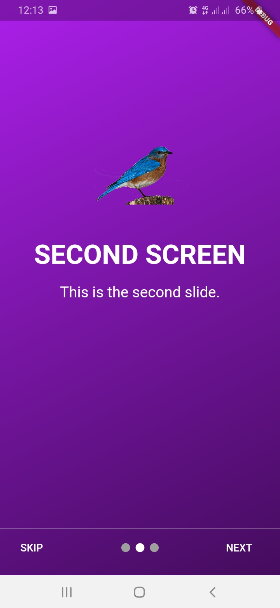

<h1 align="center">FLUTTER INTRO SLIDER</h1>

<p align="center">Flutter Intro Slider is a flutter app that helps you style your introductory view with dividers and colors.</p>

## Demo


## Installing
Add to pubspec.yaml file

```sh
dependencies:
  carousel_slider: ^1.4.1
```

Import

```sh
import 'package:carousel_slider/carousel_slider.dart';
```

<br />
or simply cone the project and run.<br />
<br />

<table>
  <tr>
    <td align="center">First Screen Intro</td>
     <td>Second Screen Intro</td>
     <td>Third Screen Intro</td>
  </tr>
  <tr>
    <td></td>
    <td></td>
    <td></td>
  </tr>
 </table>
